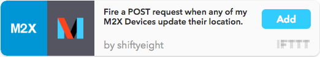

# Update M2X Device with FIPS6 and UGC on Location Change

The National Weather Service classifies the location of weather alerts by [FIPS6 county code](https://en.wikipedia.org/wiki/FIPS_county_code) and/or [Universal Geographic Code](http://www.nws.noaa.gov/emwin/winugc.htm). UGC codes identify sub-regions within county lines, thus for every one FIPS6 code there are multiple UGC areas contained within that region.

This application provides a web service which accepts a `POST` request containing an M2X Device ID, latitude & longitude and updates the M2X Device metadata with the FIPS6 county code & UGC codes.

Note: FIPS6 & UGC codes are limited to United States territories.

## Pre-Requisites

### You will need to have an account on the following services:

1. [M2X](https://m2x.att.com/signup): M2X is an IoT time-series data storage & device management service. The M2X developer tier account is free for up to 10 devices @ 100,000 max data points written per device/month. Should you desire more capacity you'll need to [upgrade your M2X Account](https://m2x.att.com/pricing).
2. [Heroku](https://www.heroku.com/): Heroku is a PaaS that enables developers to build and run applications entirely in the cloud. Make sure to install the [Heroku Toolbelt](https://toolbelt.heroku.com/), you'll need that later.
3. [Google API Key](https://developers.google.com/maps/documentation/geocoding/get-api-key): For reverse geocoding lat/lng to county/state. Note that free use of the Geocoder API is limitted to 2500 requests per day.
4. [IFTTT](https://ifttt.com): IFTTT a free web-based service that allows users to create chains of simple conditional statements, called "recipes", which are triggered based on changes to other web services such as M2X.

## Installation

### Deploying your application

Click the Heroku button to deploy your application to Heroku:

[](https://heroku.com/deploy)

### Setup Config Variables in Heroku

#### Via Heroku CLI
(requires [Heroku Toolbelt](https://toolbelt.heroku.com/))

[M2X Master API Key](https://m2x.att.com/developer/documentation/v2/overview#API-Keys):
```
heroku config:set M2X_API_KEY={YOUR-M2X-MASTER-API-KEY}
```

[Google API Key](https://developers.google.com/maps/documentation/geocoding/get-api-key):
```
heroku config:set GOOGLE_API_KEY={YOUR-GOOGLE-API-KEY}
```

[Django Secret Key](https://docs.djangoproject.com/en/1.9/ref/settings/#secret-key):
```
heroku config:set DJANGO_SECRET_KEY={UNIQUE-UNPREDICTABLE-VALUE}
```


#### Via Heroku Dashboard

You can also [edit config vars](https://devcenter.heroku.com/articles/config-vars#setting-up-config-vars-for-a-deployed-application) on your app’s settings tab on your Heroku Dashboard.

### Database Initialization

First, [clone](https://devcenter.heroku.com/articles/git-clone-heroku-app) the Heroku app that you deployed earlier:

```
heroku git:clone -a myapp
```

While in the root directory of the app, run the following command to load the Heroku PostgreSQL database  with the FIPS6 and UGC data:

```
heroku run python initialize.py
```

### IFTTT Recipe Setup

The IFTTT recipe you'll be creating leverages the [M2X](https://ifttt.com/attm2x) and [Maker](https://ifttt.com/maker) channels on IFTTT. The recipe consists of a trigger which fires an `POST` request to the Heroku app whenever an M2X device updates it's location, the alert contains the M2X Device ID, latitude and longitude. The M2X channel is responsible for sending the device information whenever there is location update, while the Maker channel is responsible for crafting and delivering the POST request containing the device info received from M2X.

Below is a sample recipe which you can add to your IFTTT account. Make sure to update the `URL` for the Maker portion of the recipe, example: `https://{your-heroku-domain}/update`, {your-heroku-domain} should be replaced with the domain for your app (you can find this in the settings for the app on your Heroku dashboard)

<a href="https://ifttt.com/view_embed_recipe/380504-fire-a-post-request-when-any-of-my-m2x-devices-update-their-location" target = "_blank" class="embed_recipe embed_recipe-l_69" id= "embed_recipe-380504"></a>

### Test it out!

Once all the setup steps above have been completed, test it out by updating one of your M2X Device's location (to somewhere within the U.S.), you should find that the custom metadata for the device is updated with the corresponding FIPS6 & UGC codes for the county associated with the lat/lng coordinates.

## How does the application convert Latitude/Longitude to FIPS6/UGC

1. The lat/lng pair is sent to the [Google Maps Geocoding API](https://developers.google.com/maps/documentation/geocoding/intro#ReverseGeocoding) to obtain the county & state for the given coordinates.
2. The FIPS6 code is obtained by searching the application database to find the FIPS6 code associated with the given county/state. This is a one to one relationship, thus only one FIPS6 code will be returned.
3. The UGC codes are obtained by searching the application database to find a set of UGC codes associated with the given county/state. One or more UGC codes will be returned, as there are multiple UGC areas contained within any county.

Note that finding the exact UGC code for a given latitude and longitude pair is not a simple task, thus this application identifies a list of possible UGC codes for the given lat/lng pair. The UGC codes returned designate sub-areas contained within the county identified for the given lat/lng pair.

## FIPS6 and UGC Data

This application contains `.csv` files in the [/data](/data) directory with the latest FIPS6 & UGC [dated Nov 10, 2015] data as of the inception of the app. Should you need to update the FIPS6 or UGC data, here are some instructions:

### Obtaining and Updating FIPS6 Data

1. [Download](http://www.nws.noaa.gov/geodata/catalog/county/html/county.htm) the latest FIPS6 data file from NWS
2. Install [OpenJump](http://www.openjump.org/) which will be used to convert the `.shp` data file to `.csv`
3. Open the `.shp` file provided by NWS with OpenJump
4. Select File > "Save Dataset As" to save the file as `.csv`, making sure to use `|` as the delimeter/field separator. Split the resulting `.csv` file into two files, name them `fips1.csv` & `fips2.csv` and store the files under the [/data](/data) directory. (splitting the files so they play nice with git, which doesn't like large files)
5. Push your code to Heroku so that the data file is updated on your Heroku app
6. Update the PostgreSQL database on your Heroku app (using Heroku toolbelt) by runniing the [initialize.py](initialize.py) script which drops the old table and creates/populates a new table with the updated data:

```
heroku run initialize.py
```

### Obtaining and Updating UGC Data

1. [Download](http://www.nws.noaa.gov/geodata/catalog/wsom/html/cntyzone.htm) the latest UGC data file from NWS (thankfully this data file is provided in  `|` delimited `.csv` format)
2. Store the file under the [/data](/data) directory and name the file `ugc.csv`, making sure to replace the outdated data file of the same name.
3. Push your code to Heroku so that the data file is updated on your Heroku app
4. Update the PostgreSQL database on your Heroku app (using Heroku toolbelt) by runniing the [initialize.py](initialize.py) script which drops the old table and creates/populates a new table with the updated data:

```
heroku run initialize.py
```

## Issues

Feel free to report any issues you encounter with this app via GitHub

## Thanks to...
* [M2X](https://m2x.att.com): time-series data store
* [Heroku](https://www.heroku.com): cloud application hosting
* [IFTTT](https://ifttt.com): triggers/actions
* [Google Maps Geocoding API](https://developers.google.com/maps/documentation/geocoding/intro#ReverseGeocoding)
* [National Weather Service Alerts]: http://alerts.weather.gov

## LICENSE

This sample application is released under the MIT license. See [`LICENSE`](LICENSE) for the terms.
